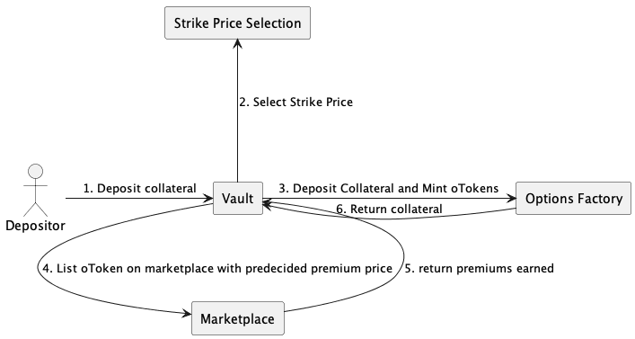
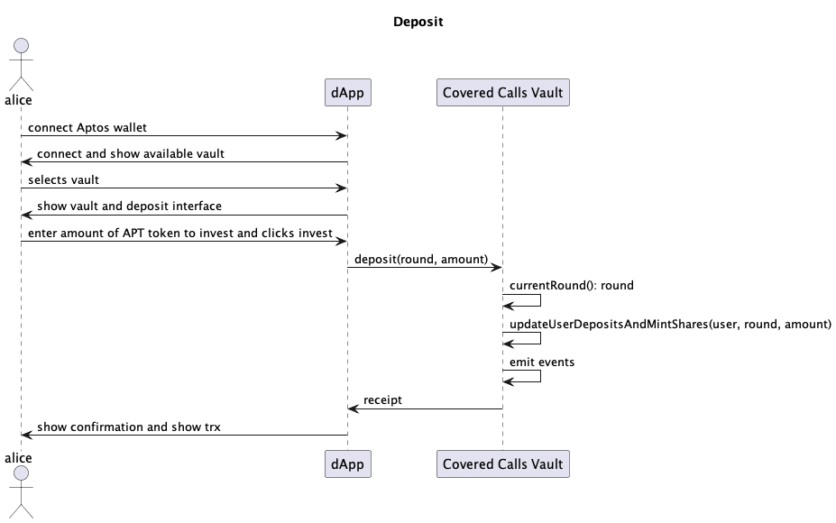
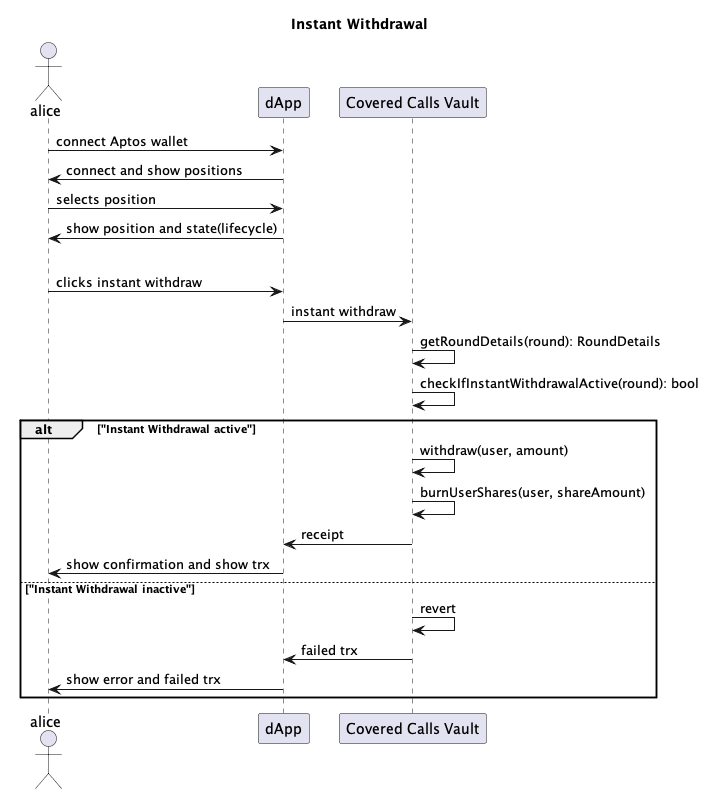
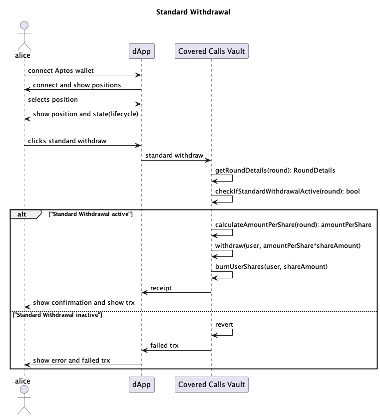
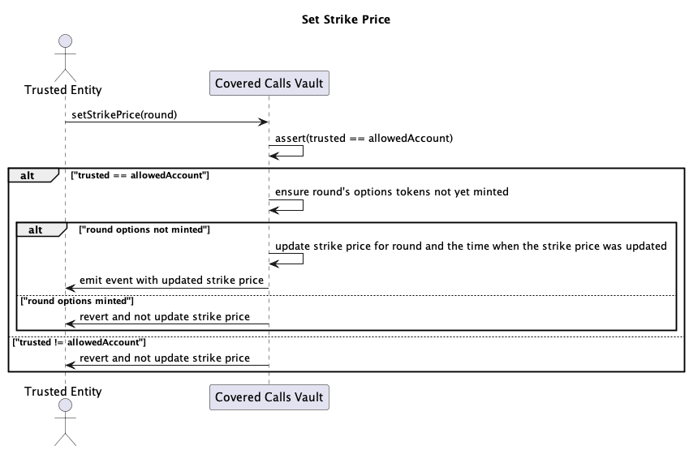
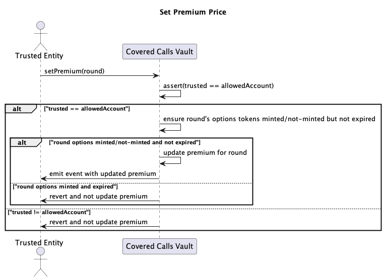
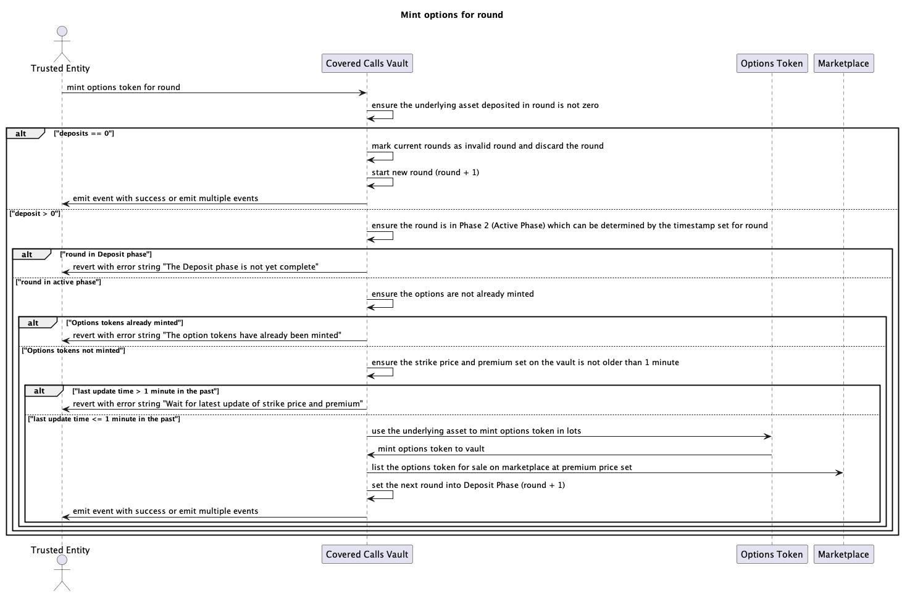
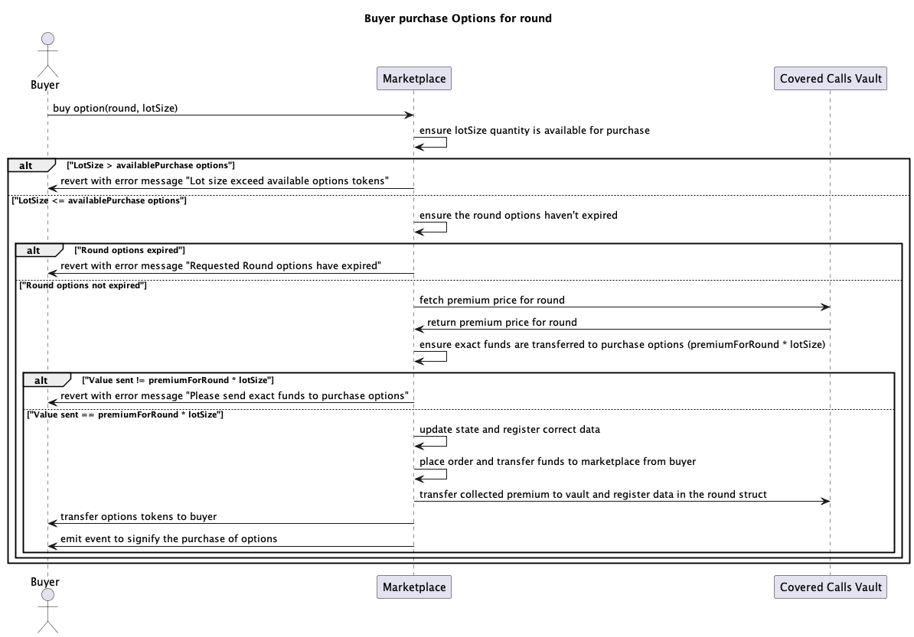
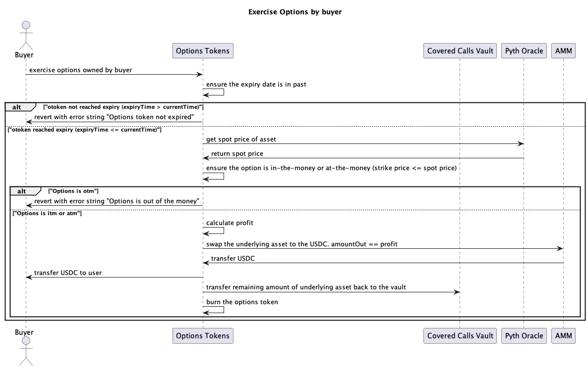
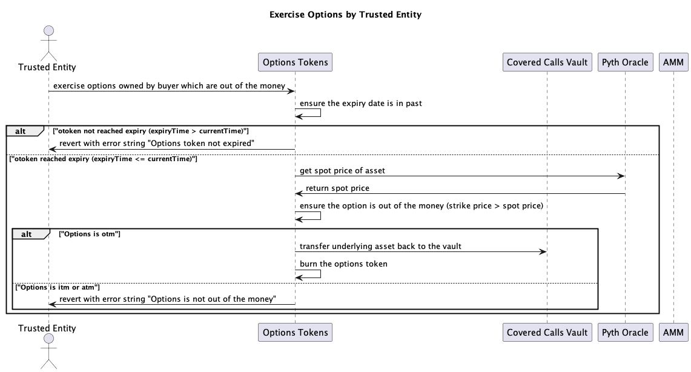

# High-level Overview

## Architecture
We will be following the same architecture as [Ribbon Finance](https://docs.ribbon.finance/theta-vault/ribbon-v2) with adaptation based on our needs.

## Deposit
Users can visit the vault page, deposit collateral into a round and get shares for the round.

## Withdrawal
Titus finance will have two types of deposit:

### Instant Withdrawal
Instant Withdrawal are the types of withdrawal where user is withdrawing the funds during the deposit phase of round `n` given the collateral deposited for round `n` is not yet used to mint options token.
When user does instant withdrawal, the user receives 100% refund and the shares are burned.

### Standard Withdrawal
Standard withdrawal are the typees of withdrawal where users is withdrawaing the total value equating to share balance of user after the execution phase given the settlement of the premiums and execution of the options contract is complete.

Note: Users are not allowed to withdraw during the active phase.

## Setting Strike Price Calculation
For now, we will periodically update the strike price using an oracle. A python script will calculate the strike price and update the strike price for the current round. The script will run using a keeper. This keeper will periodically update the strike price until the end of Deposit phase.

## Setting Premium Calculation
For now, we will periodically update the premium using an oracle. A python script will calculate the premium and update the premium for the current round. The script will run using a keeper. This keeper will periodically update the premium until the end of Deposit phase.

## Mint Options tokens
Keeper invoke a `mintOptions(round)` function given `t > tEnd(deposit Phase)` on the vault to use the deposited collateral to mint the options contract and put them on auction.

## Buyer Purchase Options tokens
Buyers can view the listed options token and purchase them. When user purchase the option token, the amount used to purchase, `premium`, will be sent to the vault and deposited as `premiumCollected` in a round.

## Exercise Options Token:
After the expiry date, i.e. when the active phase ends and the execution phase starts, keeper will call "settle" on vault to exercise the option token. Based on the state of collateral market price and the strike price:
### In-the-money (ITM) execution
If the `strikePrice < marketPrice`, then use the collateral to swap the collateral to USDC. When swapping, the amountOut for USDC should be `marketPrice - strikePrice`. Transfer the USDC to buyer and remaining collateral back to vault as returned collateral to a round. Burn the Options token.

### Out-of-the-money (OTM) execution
If the `strikePrice > marketPrice`, then return the collateral back to vault as returned collateral to a round. Burn the Options token.

